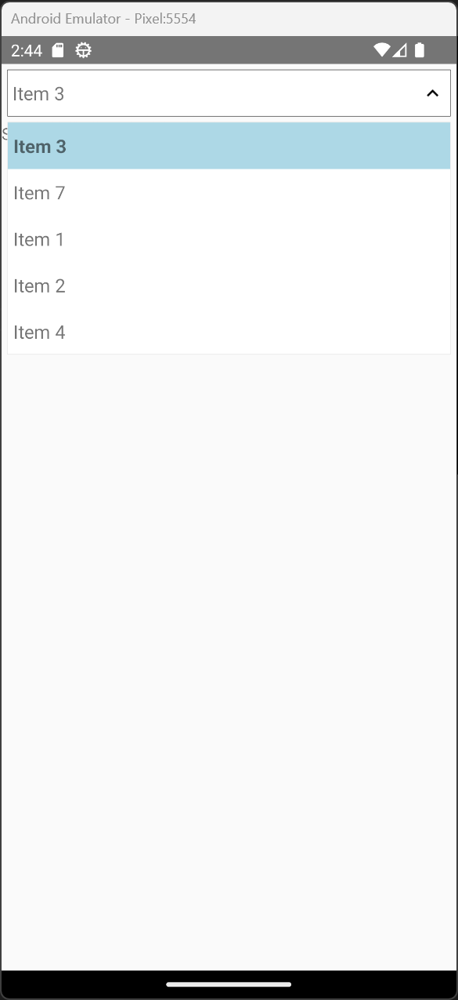
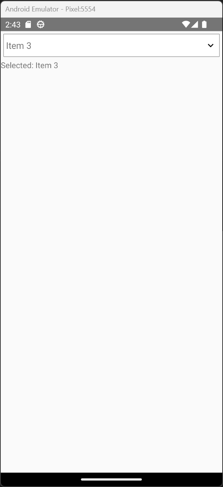

# React Native Dropdown Selector

A custom react native component for dropdown lists. Emulates some functionality of the HTML `<select>` tag.

## Features

- Cross-platform uniformity
- Select one or more items from the list
- Support for custom component styling
- Import data with versatile structure
- Item prioritization

## Demo

Create a react native project with `example/App.tsx` as the main file. Running the application will look similar to the screenshots below.

 

## Usage

All example code is written in TypeScript. <br />
Begin by importing the Selector component and Data type.

```tsx
import Selector, { Data } from 'react-native-dropdown-selector';
```

Define your Data array. The label field is required for each entry, but priority and data are optional.

```tsx
const data: Data[] = [
  { label: 'Item 1' },
  { label: 'Item 2', data: { additionalParam: 'value' } },
  { label: 'Item 3', priority: true },
];
```

Define your onSelect function. Your function will only take in a Data object.

```tsx
const onDataSelect = (data: Data) => {
  // Do something
};
```

Add a Selector component to your view.

```tsx
<>
  <Selector.Select data={data} onSelect={onDataSelect} />
  {/* or use the MultiSelect component */}
  <Selector.MultiSelect data={data} onSelect={onMultiDataSelect} />
</>
```

That's it! Run your app to see the selector in action.

## The `Data` Object

You must follow the formatting of this object for the selector component to function.

### `label` **(required)**

The value of the item shown in the selector. <br />
Type: `string | JSX.Element`

### `priority`

If enabled, the element will move to the top of the list regardless of its current position. <br />
Type: `boolean`

### `data`

Additional data for the item. This is not directly used by the Selector component. <br />
Type: `object`

## Props

### `data` **(required)**

Holds the items used for the Selector. <br />
Type: `Data[]`

### `defaultValue`

Choose an item to be selected before the user interacts with the Selector. <br />
Type: `Data` (single select) or `Data[]` (multi select)

### `listHeight`

The height of the dropdown list. Defaults to 200. <br />
Type: `number`

### `placeholderText`

Replace the default Selector text when an item hasn't been selected. The default value is `Click me`. <br />
Type: `string | JSX.Element`

### `boxStyle`

Custom styles for the main Selector box. <br />
Type: `ViewStyle`

### `boxTextStyle`

Custom styles for the text inside the main Selector box. <br />
Type: `ViewStyle`

### `boxTextHighlightStyle` (MultiSelect only)

Custom styles for the text highlight inside the main Selector box. <br />
Type: `ViewStyle`

### `listStyle`

Custom styles for the Selector dropdown list. <br />
Type: `ViewStyle`

### `listTextStyle`

Custom styles for the text inside the Selector dropdown list. <br />
Type: `ViewStyle`

### `selectedItemStyle`

Custom styles for the active item inside the Selector dropdown list. <br />
Type: `ViewStyle`

### `dropdownArrowColor`

Custom color for the dropdown arrow inside the main Selector box. <br />
Type: `ColorValue`

## Callbacks

### `onSelect` **(required)**

Called when the user selects an item from the selector. <br />
Type: `Function (e: Data) => void` (single select) or `Function (e: Data[]) => void` (multi select)

## Development

To contribute to the development of this project, please refer to the [development guide](./docs/Development.md).