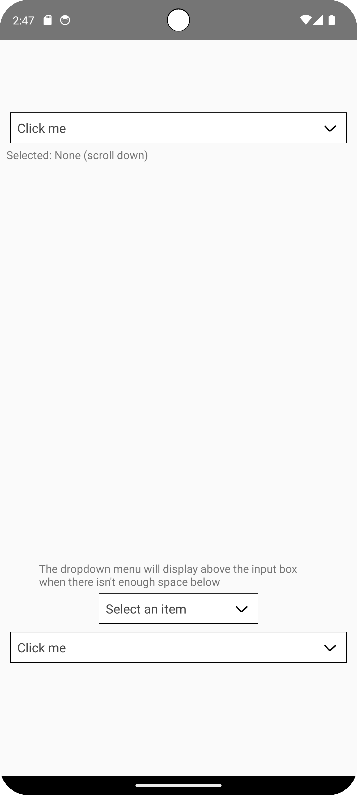
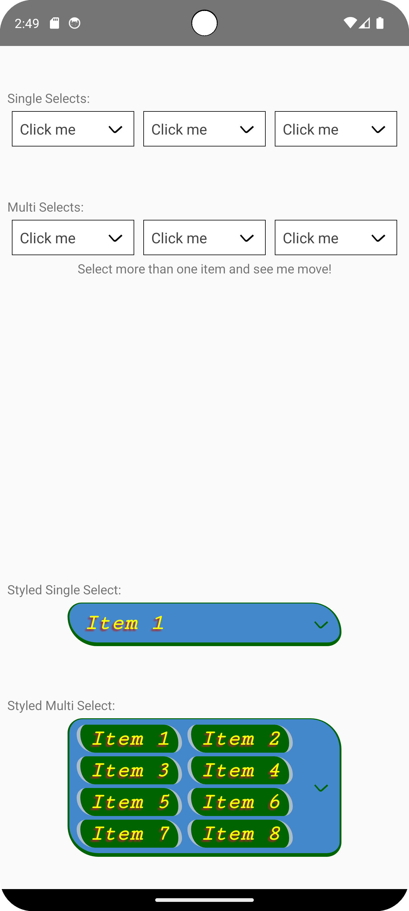

# React Native Dropdown Selector

A custom react native component for dropdown lists. Emulates some functionality of the HTML `<select>` tag.

## Features

- Cross-platform uniformity
- Select one or more items from the list
- Support for custom component styling
- Import data with versatile structure
- Item prioritization

## How Do I Use It?

There are 2 components available for use:
[`Select`](https://github.com/rhventures/react-native-dropdown-selector/wiki/Select)
and
[`MultiSelect`](https://github.com/rhventures/react-native-dropdown-selector/wiki/MultiSelect)

For example, the syntax for using `Select` would look something like the following:
```tsx
<Select
  data={data}
  onSelect={console.log}
/>
```
The data prop takes in an array of the [`Data`](https://github.com/rhventures/react-native-dropdown-selector/wiki/Data) object, and the onSelect prop takes in a function that accepts an argument of type `Data`.

There are other optional props too. For more information about how to use these components, check out the
[wiki](https://github.com/rhventures/react-native-dropdown-selector/wiki).

## How Do I *actually* Use It?

We will use TypeScript for this example.

First, begin by importing a selector component and the `Data` type. In this case, we will use `Select`:
```tsx
import { Select, type Data } from 'react-native-dropdown-selector';
```
Then, create an array of items of type `Data`. This will be used for the `data` prop of the selector:
```tsx
const data: Data[] = [
  { label: 'Item 1' },
  { label: 'Item 2' },
  { label: 'Item 3' },
]
```
Next, define a function that we will use for the `onSelect` prop:
```tsx
const onDataSelected = (data: Data) => {
  console.log(data.label + ' was selected!');
};
```
Finally, piece it all together:
```tsx
<Select
  data={data}
  onSelect={onDataSelected}
/>
```
For a more detailed guide on how to use these components, make sure to read [Getting Started](https://github.com/rhventures/react-native-dropdown-selector/wiki/Getting-Started).

## Demo

Create a react native project with `example/App.tsx` as the main file. Running the example application will look similar to the screenshots below.

  

For an in-depth walkthrough, start from the "[Install Dependencies](https://github.com/rhventures/react-native-dropdown-selector/wiki/Development#install-dependencies)" section on the development guide.

## Development

To contribute to the development of this project, please refer to the [development guide](https://github.com/rhventures/react-native-dropdown-selector/wiki/Development).