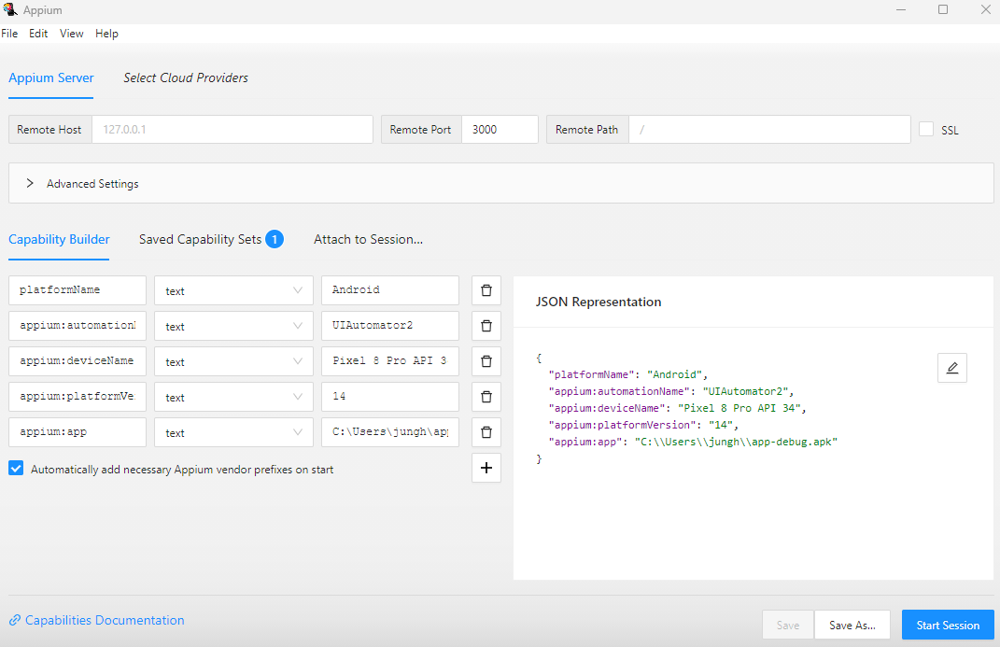

# Using APPIUM and APPIUM Inspector for React Native GUI testing on Android Applications. 

## Why APPIUM? 
Well... Selenium does not support mobile apps for test yet... Appium can not only be used for testing web apps, but it can also be used for testing iOS, Android or Watch OS such as Tizen. 

If you would like to know more information about Appium Software, here is the URL:
https://appium.io/docs/en/latest/intro/

## *We are only testing on Android Platform on Windows OS at this time*

## General Prerequisites for using APPIUM

### Programming Proficiency
-   Acceptable Knowledge in Javascript, Java, or Python.

### Install Node.JS
-   https://nodejs.org/en


## Android Setup
-   [Install Android Studio](https://developer.android.com/studio?hl=es-419&gclsrc=aw.ds&gclid=Cj0KCQjwyOuYBhCGARIsAIdGQRNrDv20QvoOy_-I5E1LoZdOLu3nvhlwX_7EjPeHcE1kGQNNcIVOme0aAqckEALw_wcB) 
-   [Android Home Setup](https://www.testingdocs.com/setting-android_home-environment-variable-on-windows) -> this could already be done if you have android studio set up already.

### Install Appium Inspector
-   [Download the compatable Appium Inspector here](https://github.com/appium/appium-inspector/releases)
-   I used the win.x64.exe

### Install Appium
-   [Appium](https://appium.io/docs/en/latest/quickstart/install/)
or run this command in your terminal:
```
npm install -g appium
```
Check your appium version using 
```
appium -v
```
### Execute Appium Doctor
For Appium to work, the necessary downloads must be checked.
run:
```
npm install appium doctor -g
```
and then run:
```
appium-doctor
```
-   If there is necessary fix that must be done, it must be done. For optional fixes, it can be ignored.

### Install Appium Drivers
We will use a driver for the Appium to function properly. Run:
```
appium driver install uiautomator2
```
You can check the installed drivers using:
```
appium driver list
```

### Generate a debug app to test.
If you already have the app as an apk file, then you can skip this step

If you do not have an apk file to test:
1. cd into your root of the project terminal and run:
```
react-native bundle --platform android --dev false --entry-file index.js --bundle-output android/app/src/main/assets/index.android.bundle --assets-dest android/app/src/main/res
```
2. cd into your android directory and run:
```
./gradlew assembleDebug
```
3. You should be able to find your app-debug.apk inside \n
"yourProject/android/app/build/outputs/apk/debug/app-debug.apk"

### Make a Test Folder in your project
1. From the root of your project directory, create a new folder for testing.
2. In the new folder, create new folders named "app"
3. In the app folder, copy and paste your debug app you generated above.

-   My folder hierchy looks like this:
-   

## Setup the WebDriverIO
1. Run the following command in the new testing folder in the root directory. In my case, it would be the **Test-DropDown-Selector**
```
npm init wdio
```
This will trigger the installation process. Now move on to the configurations
### Configurations
- **Project name**: Assuming you are in the right folder...: Yes
- **E2E Testing**
- **Where**: On my local machine
- **Mobile** - native, hybrid and mobile web apps ... -> If its a web application, choose Web
- **Android** : Mobile Environment
- **Framework**: I used Mocha, but feel free to use what you need 
- No Compiler
- No autogenerate
- **Reporter**: **spec**
- **Plugins**: NONE. Just press Enter
- **Visual testing**: Default
- **Add a service**: Appium
- Run npm install
- Continue with Appium setup using appium-installer?: NO

## Configure your wdio.config.js file
There should be a **wdio.conf.js** file generated in the testing folder you previously created

Now in create a folder named **test** in newly made testing folder. This is where all the test files will go.
Anything not mentioned here can be left as default

-   **local** : 4723
-   **Specs** : this is where your test files go. If your test file name is **HelloWorld.js**, then the snippet might look like:
```
specs : [
    './test/HelloWorld.js'
]

``` 
-  **Max Instances** : Read the description this can change based on test environment.
-  **Capabilities**: *This can change based on your development settings.*
    -   **platformName**: Android
    -   **appium:deviceName**: The emulator name you are using. CHeck Android Studio
    -   **appium:platformVersion**: Check your Android Studio
    -   **appium:automationName**: UiAutomator2
    -   **appium:app**: the path to the debug app you generated earlier.

My code snippet looks like:
```
capabilities: [{
        // capabilities for local Appium web tests on an Android Emulator
        platformName: 'Android',
        'appium:deviceName': 'Pixel 8 Pro API 34',
        'appium:platformVersion': '14.0',
        'appium:automationName': 'UiAutomator2',
        'appium:app': "C:/Users/jungh/app-debug.apk",
    }],
```
-   **framework** : Make sure this is *mocha*
-   **mochaOpts** : the timeout here sets the time limit on the test case.
    -   I set mine to :
    ```
    mochaOpts: {
        ui: 'bdd',
        timeout: 60000
    },
    ```
-   Remaning can be left default

-   Now install Appium in your testing folder, **not the "test" folder**
```
    npm install --save-dev appium@next
```

## Setting up your Appium Inspector
1. Open your Appium Inspector you installed earlier. 
2. go to Appium Inspector Tab, configure your boxes:

-   **Remote Host** : default. -> Mine is 127.0.0.1
-   **Remote Port** : Set it to some number besides 4723. Mine is 3000
-   **Remote Path** : default. -> Mine is /

3. Now in the JSON Representation Tab, copy the **specs** code snippet from *wdio.conf.js* file and paste it.
4. Now in the capacity builder, make sure all the middle boxes are showing *text*
5. click *save*

-   After everything, your set up should look similar to this:
-   
6. Leave the Inspector open for the Next Step

### Connect your Appium Inspector with your app
1. Open up terminal. 
2. Run this snippet in your terminal, with the *<'Port Number'>* being your number from the **Remote Port** number from Appium Inspector Setup:
```
appium -p <Port Number>
```
3. Now the server for appium inspector should be running
4. Now click **Start Session** in the bottom right corner. 
5. If it connects, congradulations! Move on to the next section.


# Using the APPIUM Inspector

## Initial Screen
1. Once the connection is successful, the initial screen of your app will load. *Significant chance that you will spot a bug here, where your screen in the appium inspector might be stuck on the loading screen, like this following image.*
    -   In this case, click the red 


