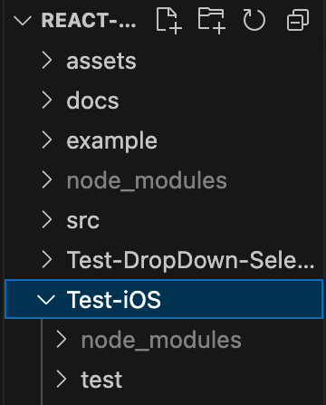

# Using APPIUM and APPIUM Inspector for React Native GUI testing on iOS Applications

## Why APPIUM? 
Well... Selenium does not support mobile apps for test yet... Appium can not only be used for testing web apps, but it can also be used for testing iOS, Android or Watch OS such as Tizen. 

If you would like to know more information about Appium Software, here is the URL:
https://appium.io/docs/en/latest/intro/

## *We are only testing on iOS Platform on Mac OS at this time*

## General Prerequisites for using APPIUM

### Programming Proficiency
-   Acceptable Knowledge in Javascript, Java, or Python.

### Install Node.JS
-   https://nodejs.org/en

## iOS Setup
1.  Install Xcode from the MacOS App Store.
2.  Install Xcode Command Line Tools: 
```
xcode-select --install
```
-   to make sure it is installed:
```
xcode-select -p
```

### Install Appium Inspector
-   [Download the compatable Appium Inspector here](https://github.com/appium/appium-inspector/releases)
-   I used the mac.arm64.exe
    - *When using a macbook, make sure to know if your mac supports x64 or arm 64!*

### Install Appium
-   [Appium](https://appium.io/docs/en/latest/quickstart/install/)
or run this command in your terminal:
```
npm install -g appium
```
Check your appium version using 
```
appium -v
```
### Execute Appium Doctor
For Appium to work, the necessary downloads must be checked.
run:
```
npm install appium doctor -g
```
and then run:
```
appium-doctor
```
-   If there is necessary fix that must be done, it must be done. For optional fixes, it can be ignored.

### Install Appium Drivers
We will use a driver for the Appium to function properly. Run:
```
appium driver install xcuitest
```
You can check the installed drivers using:
```
appium driver list
```

## Generating a debug app to test.
If you already have the app as an ipa file, then you can skip this step

### Using React-Native
**If you do not have an ipa file of your app :**
-   go to [React Native Set Up](https://reactnative.dev/docs/set-up-your-environment) and follow the instructions to integrate with the existing app you have through [Integration w/ Existing Apps](https://reactnative.dev/docs/integration-with-existing-apps)
-   After you have successfully integrated your app with with React Native, you should have brew installed. Now go ahead and install the dependency Carthage
```
brew install carthage
``` 
-   now proceed to the next step.


### Generating the debug app
-   Once you run the command at the proper directory:
```
npm run ios
```
-   you will get something like:
```
Installing "/path/to/your/debug/app/example.app"
```
-   This will be your app path. **REMEMBER THIS PATH!**

## Setup the WebDriverIO
-   Create a new folder named like "Test-<'CustomName'> under your root project directory
-   My folder heirarchy looks like: 
-   
-   In my case, it would be the **Test-iOS**
2. Run the following command in the new folder you just created
```
npm init wdio
```
This will trigger the installation process. Now move on to the configurations
### Configurations
- **Project name**: Assuming you are in the right folder...: Yes
- **E2E Testing**
- **Where**: On my local machine
- **Mobile** - native, hybrid and mobile web apps ... -> If its a web application, choose Web
- **iOS** : Mobile Environment
- **Framework**: I used Mocha, but feel free to use what you need 
- No Compiler
- No autogenerate
- **Reporter**: **spec**
- **Plugins**: NONE. Just press Enter
- **Visual testing**: Default. Just Press Enter
- **Add a service**: Appium
- Run npm install
- Continue with Appium setup using appium-installer?: NO

## Configure your wdio.config.js file
There should be a **wdio.conf.js** file generated in the testing folder you previously created

Now in create a folder named **test** in newly made testing folder. This is where all the test files will go.
Anything not mentioned here can be left as default

-   **Port** : 4723
-   **Specs** : this is where your test files go. If your test file name is **HelloWorld.js**, then the snippet might look like:
```
specs : [
    './test/HelloWorld.js'
]

``` 
-  **Max Instances** : Read the description this can change based on test environment.
-  **Capabilities**: *This can change based on your development settings.*
    -   **platformName**: iOS
    -   **BrowserName** : *Delete this line, we are not using a browser driver*
    -   **appium:deviceName**: The emulator name you are using. Check iOS Simulator
    -   **appium:platformVersion**: Check your iOS Simulator
    -   **appium:automationName**: = XCUItest
    -   **appium:app**: the path to the debug app you generated earlier.

My code snippet looks like:
```
capabilities: [{
        // capabilities for local Appium web tests on iOS
        platformName: 'iOS',
        'appium:deviceName': 'iPhone 15 Pro',
        'appium:platformVersion': '17.5',
        'appium:automationName': 'XCUITest',
        'appium:app' : iosAppPath
    }],
```
-   **framework** : Since I choose Mocha, I have it as *Mocha*, However, make sure this matches the testing framework you choose 
-   **mochaOpts** : the timeout here sets the time limit on the test case.
    -   I set mine to :
    ```
    mochaOpts: {
        ui: 'bdd',
        timeout: 60000
    },
    ```
-   Remaning can be left default

-   Now install Appium in your testing folder, **not the "test" folder**
```
    npm install --save-dev appium@next
```

## Setting up your Appium Inspector
1. Open your Appium Inspector you installed earlier. 
2. go to Appium Inspector Tab, configure your boxes:

-   **Remote Host** : default. -> Mine is 127.0.0.1
-   **Remote Port** : Set it to some number besides 4723. Mine is 3000
-   **Remote Path** : default. -> Mine is /

3. Now in the JSON Representation Tab, copy the **Capabilities** code snippet from *wdio.conf.js* file and paste it.
4. *platformName* should also be in quotes.* Click save
5. Your capacity builder should be filled. If it is not automatically filled, it must be manually filled.
6. Now in the capacity builder, make sure all the middle boxes are showing *text*
7. Save the capability set

-   After everything, your set up should look similar to this:
-   
8. Leave the Inspector open for the Next Step

### Connect your Appium Inspector with your app
1. Open up terminal. 
2. Run this snippet in your terminal, with the *<'Port Number'>* being your number from the **Remote Port** number from Appium Inspector Setup:
```
appium -p <Port Number>
```
3. Now the server for appium inspector should be running
4. **Make sure your simulator is up and running.**
5. **Make sure the app is running on the simulator-> run this command at your ios directory**
```
npm run ios
```
6. Now click **Start Session** in the bottom right corner. 
7. If it connects, congradulations! Move on to the next section.


# Using the APPIUM Inspector
**GO WATCH:**
-   [Tutorial](https://www.youtube.com/watch?v=Q5Oy8axA8Qw&t=1225s) start from 17:40
-   There are much more ways to find elements and generate assertions through using appium inspector. Take a look at this [WebdriverIO Docs](https://webdriver.io/docs/api/browser)
-   Now go and mess with test cases and see what is the most optimized method for your project.

### To Run the Test files
-   Run:
```
npx wdio
```

## Error Handling*
-   If you run into an error: *"No spec files to run"* 
    -   You do not have your test files specified in specs at *wdio.conf.js*

-   If you run into an error: *"Connection Refuse error"*
    -   That means the server port is occupied. Run this command to kill all the active ports:
    ```
    pkill -9 -f appium
    ```
-    if you run into an error: *"ts-node/esm/trasnpile-only 'resolve' did not call the next hook.."*
    -   Running the following command will fix it.
    ```
    npm i -D typescript ts-node
    ```

